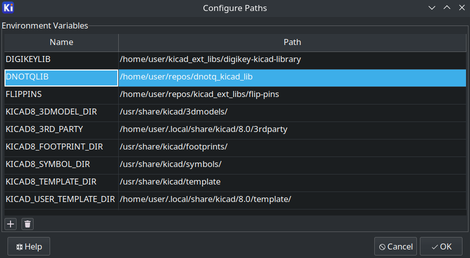
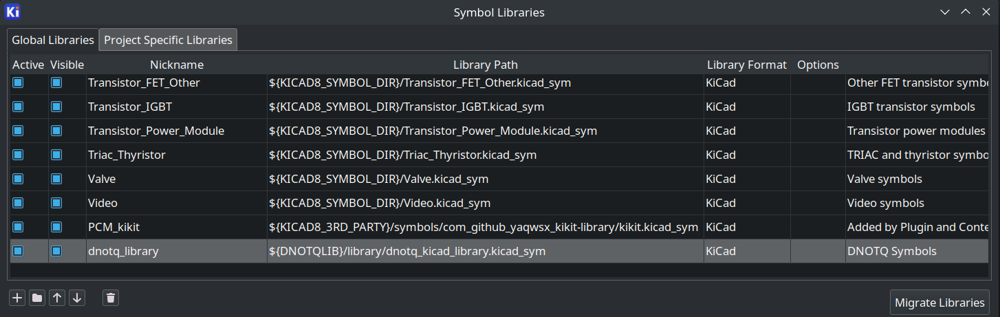
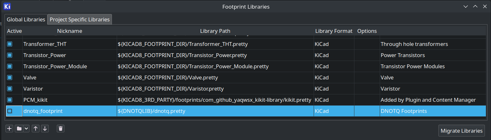
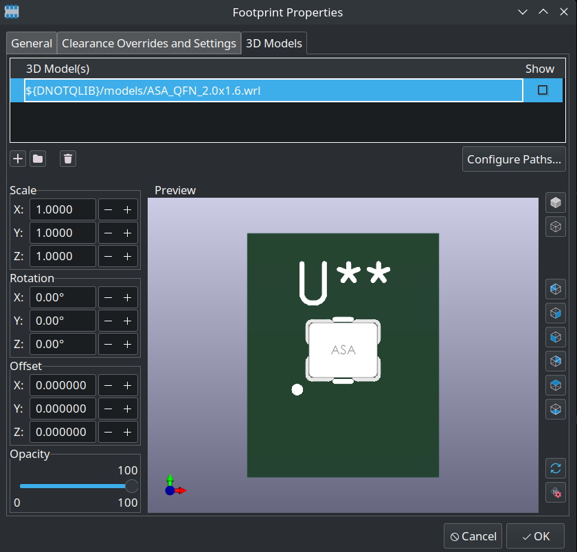
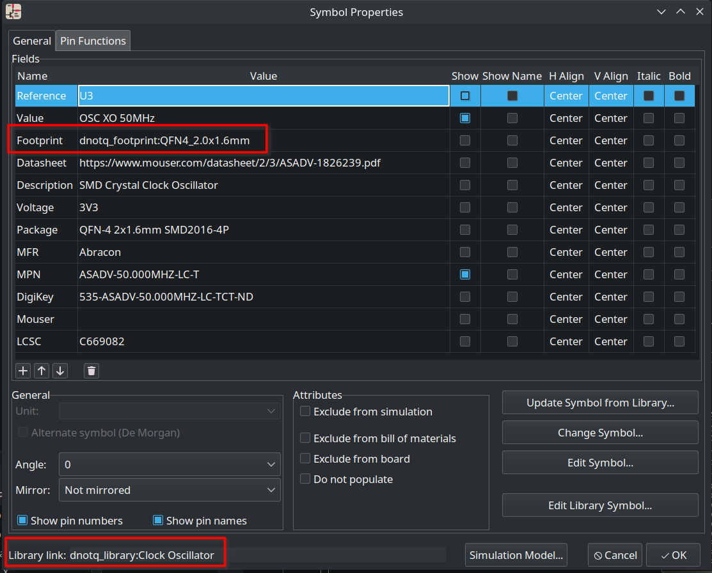

# DNOTQ KiCAD Library

2025 April 14:

This readme is a bit of a mess and needs some work.  The way of adding the libs
changed, so there are two conflicting methods.  The second should be the best to
use.

Parts and footprints used in DNOTQ designs.

To set up the library:

- Clone the repository to whereever you want on your system.
- Start KiCAD, select `Preferences -> Configure Paths`
- Create a new Environment Variable called `DNOTQLIB` and set the path to where you cloned the repository:

- Select `Preferences -> Manage Symbol Libraries...`
- Click the `+` icon "Add empty row to table", then:
   * Check the `Active` checkbox
   * For the "Nickname" enter `dnotq_library`
   * For the "Library Path" enter `${DNOTQ_SYMBOLS}/dnotq_kicad_library.kicad_sym`
   * For the "Library Format" select `KiCad`
   * For the "Description" enter `DNOTQ Symbols`

Setting up the footprints is the same process as the symbols:

- Select `Preferences -> Manage Footprint Libraries...`
- Click the `+` icon "Add empty row to table", then:
   * Check the `Active` checkbox
   * For the "Nickname" enter `dnotq_footprint`
   * For the "Library Path" enter `${DNOTQ_FOOTPRINTS}`
   * For the "Library Format" select `KiCad`
   * For the "Description" enter `DNOTQ Footprints`

All models for footprints use the `${DNOTQLIB}` environment variable prefix, so all previews of boards using these parts should "just work" as expected.

Symbols and footprints from the libarary will use the `dnotq_library` and `dnotq_footprint` nicknames set in the steps above.  This allows the entire library to be located or moved anywhere by simply changing the one `${DNOTQLIB}` environment variable.

DNOTQ_FOOTPRINTS  ${DNOTQ_LIB_PATH}\footprints
DNOTQ_LIB_PATH    P:\Projects\dnotq_kicad_lib
DNOTQ_MODELS      ${DNOTQ_LIB_PATH}\models
DNOTQ_SYMBOLS     ${DNOTQ_LIB_PATH}\symbols
FLIPPINS          E:\kicad_libs\flip-pins\flip-pins_3d

dnotq_library     ${DNOTQ_SYMBOLS}/dnotq_kicad_library.kicad_sym
dnotq_footprint   ${DNOTQ_FOOTPRINTS}

# Design Rules

JLCPCB:

Board dimension: ±0.1mm(Precision) / ±0.2mm(Regular) for CNC routing, ±0.4mm for V-scoring

6 layer: [https://jlcpcb.com/6-layer-pcb]
Minimum trace width and spacing: 3.5mil (0.09mm)
Min. Via hole size/diameter: 0.15mm / 0.25mm
Min. BGA Pad Dimensions: 0.25 mm
Drill Hole Size: 0.15mm - 6.30mm
Drill Hole Size Tolerance: +0.13/-0.08mm
Min. Pad Size: 1.0mm

1..4 layer: [https://jlcpcb.com/capabilities/pcb-capabilities]

JLCPCB POFV (Plated Over Filled Via) Requirements 2024:

Tented or epoxy filled holes must be <= 0.5mm.
Tented, ideally <= 0.4mm.
Epoxy filled & Capped,

|<-- AR -->|<-- hole -->|<-- AR -->|

 0.05-0.075    0.2-0.5

[https://jlcpcb.com/help/article/pcb-via-covering]
For epoxy-filled vias, please leave a note or upload an image along with your design files to explain which vias should be filled. Alternatively, you can specify to fill all vias of a particular diameter.
