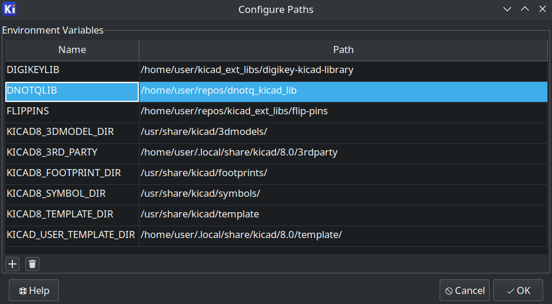
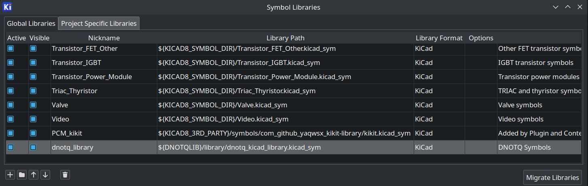
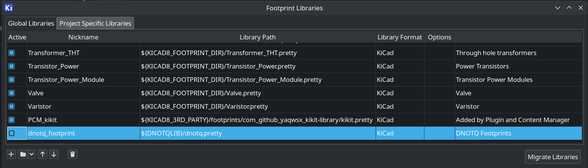
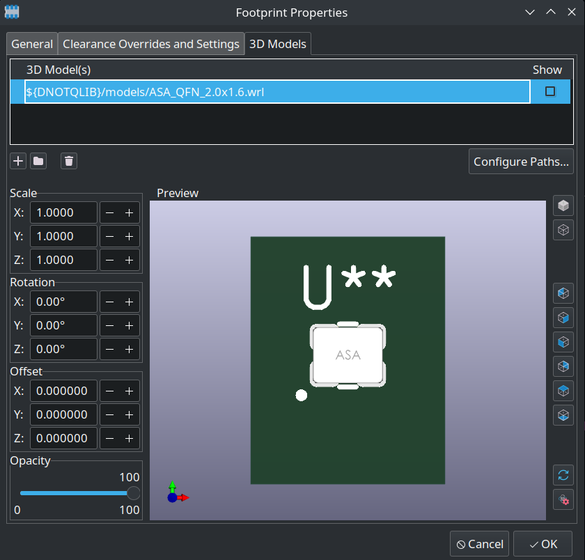

# DNOTQ KiCAD Library

Update 2026 May 12:

The library has been migrated to use the directory features of KiCad 10.x and later:

- Part symbols are each **unpacked** into their own `.kicad_sym` file, and stored in `.kicad_symdir` directories.
- The references for the library use a **Table** entry in the library `fp-lib-table` and `sym-lib-table` files.

TODO: Make new images and fix their links.

---

This repository contains the part symbols, footprints, and models used in DNOTQ KiCad designs.


To set up the library:

- Clone the repository to where ever you want on your system.
- Start KiCAD, select `Preferences -> Configure Paths`
- Create a new Environment Variable called `DNOTQ_DIR` and set the path to where you cloned the repository:



- Select `Preferences -> Manage Symbol Libraries...`
- Click the `+` icon "Add empty row to table", then:
   * Check the `Enable` and `Show` checkboxes
   * Set the `Nickname` to `dnotq`
   * Set the `Library Path` to `${DNOTQ_DIR}/dnotq-sym-lib-table`
   * Set the `Library Format` to `Table`
   * Set the `Description` to `DNOTQ Symbols`



Setting up the footprints is the same process as the symbols:

- Select `Preferences -> Manage Footprint Libraries...`
- Click the `+` icon "Add empty row to table", then:
   * Check the `Enable` and `Show` checkboxes
   * Set the `Nickname` to `dnotq`
   * Set the `Library Path` to `${DNOTQ_DIR}/dnotq-fp-lib-table`
   * Set the `Library Format` to `Table`
   * Set the `Description` to `DNOTQ Footprints`



All models for footprints use the `${DNOTQ_DIR}` environment variable prefix, so all previews of boards using these parts should "just work" as expected.



Symbols and footprints from the library use references set in the library's local `dnotq-sym-lib-table` and `dnotq-fp-lib-table`.  This allows the entire library to be located anywhere by simply changing the one `${DNOTQ_DIR}` environment variable.


# Design Rules

JLCPCB:

Board dimension: ±0.1mm(Precision) / ±0.2mm(Regular) for CNC routing, ±0.4mm for V-scoring

- 6 layer: <https://jlcpcb.com/6-layer-pcb>
- Minimum trace width and spacing: 3.5mil (0.09mm)
- Min. Via hole size/diameter: 0.15mm / 0.25mm
- Min. BGA Pad Dimensions: 0.25 mm
- Drill Hole Size: 0.15mm - 6.30mm
- Drill Hole Size Tolerance: +0.13/-0.08mm
- Min. Pad Size: 1.0mm

1..4 layer: <[https://jlcpcb.com/capabilities/pcb-capabilities>

JLCPCB POFV (Plated Over Filled Via) Requirements 2024:

Tented or epoxy filled holes must be <= 0.5mm.
Tented, ideally <= 0.4mm.
Epoxy filled & Capped,

```
|<-- AR -->|<-- hole -->|<-- AR -->|

 0.05-0.075    0.2-0.5
```

<[https://jlcpcb.com/help/article/pcb-via-covering>

For epoxy-filled vias, please leave a note or upload an image along with your design files to explain which vias should be filled. Alternatively, you can specify to fill all vias of a particular diameter.
